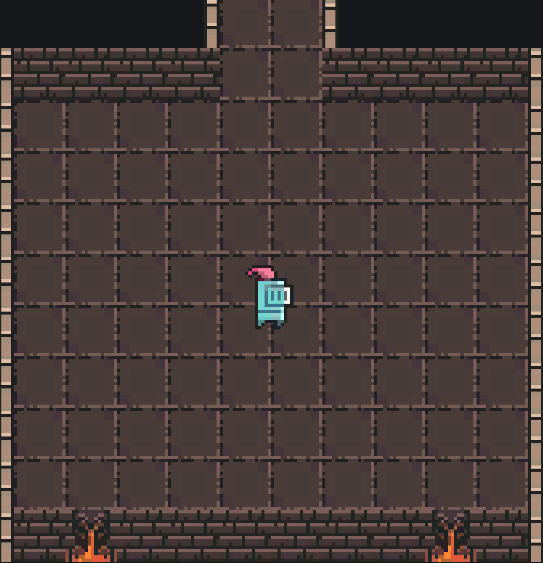

# 🎮 Sparta Metaverse Project (개인 과제)

**스파르타 메타버스 만들기 개인 과제**로 진행한 프로젝트입니다.  
필수 기능을 포함하여 Player 이동, 맵 상호작용, 미니게임, NPC 대화 등 메타버스의 주요 요소를 구현하였습니다.

---

## 📌 필수 구현 기능

- ✅ 캐릭터 이동
- ✅ 맵 설계 및 상호작용
- ✅ 미니게임
- ✅ 점수 시스템
- ✅ 게임 종료 및 복귀
- ✅ 카메라 추적 기능

---

## 📸 프로젝트 캡처

## 📺 실행 영상

> 아래 영상에서 프로젝트의 전체 실행 모습을 확인할 수 있습니다.

---

## 🚀 주요 시스템 설계

### 🧠 Player 이동 (FSM 패턴 기반)

기존 단순 이동 방식 대신 **StateMachine (FSM)** 패턴을 도입하여  
`Idle`, `Move`, `Attack` ,`Jump` 등의 상태를  State를 상속받은 **PlayerState**로 명확히 구분했습니다.

- 상태 별로 이동 로직을 분리하여 깔끔한 구조 유지
- 상태 전환이 용이하여 확장성 높음
- 복잡한 동작도 체계적으로 관리 가능

> 📌 사용 기술: 디자인 패턴 (State, FSM)

---

### 🎮 Minigame (Stage + ScriptableObject + ObjectPool + Factory + Rank System)

**3단계 Stage 시스템**으로 미니게임을 구성하고,  
각 스테이지 데이터는 **ScriptableObject**를 사용하여 효율적으로 관리합니다.

- 몬스터 생성은 **ObjectPool**과 **Factory 패턴**을 결합한 **PoolFactory**로 최적화하였습니다.
- 플레이어와 몬스터가 충돌하면 **게임이 종료**됩니다.
- 플레이어가 몬스터를 **공격으로 처치**하면 **포인트가 증가**합니다.
- 획득한 포인트는 **Rank System**을 통해 최고 점수를 기록합니다.
    - 상위 3위까지 포인트를 저장하고 관리합니다. (1위 ~ 3위)

> 📌 사용 기술: ScriptableObject, ObjectPool, Factory 패턴, 점수 시스템, 랭크 시스템

---

### 🧑‍🤝‍🧑 NPC 대화 시스템 (CSV 데이터 기반)

NPC 대사는 **CSV 파일**로 외부에서 관리하여 쉽게 추가 및 수정이 가능합니다.

- CSV를 통해 대사, 선택지, NPC 이름을 관리
- 선택지와 NextDialogueID를 List로 처리하여 대화 분기 구현
- 데이터와 로직 분리로 유지보수성 향상

> 📌 사용 기술: CSV 파싱, 데이터 기반 대화 시스템

---
